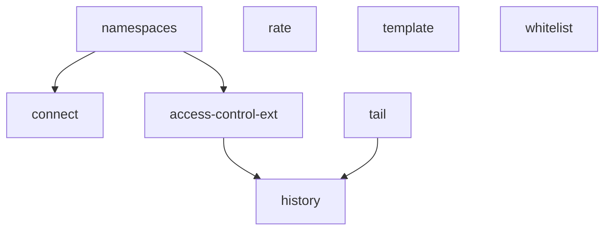

## About
Dynamic and seasoned IT professional with a solid background in web development, blockchain, and data science. With over two decades of experience in the IT industry, specialize in building and optimizing interactive, user-friendly applications and systems. Proficient in an array of programming languages and tools, including Solidity, TypeScript, React, NodeJS, Python, Java, Rust, Bash and various DevOps technologies.

## Currently
🔭 I’m currently working on [github.com/andreas-timm](https://github.com/andreas-timm)

## Announcements (Not Public)
- [contract-rate](https://github.com/andreas-timm/contract-rate) — Simple direct uin32 rate.
- [contract-access-control-ext](https://github.com/andreas-timm/contract-access-control-ext)
- [contract-connect](https://github.com/andreas-timm/contract-connect)
- [contract-history](https://github.com/andreas-timm/contract-history)
- [contract-namespaces](https://github.com/andreas-timm/contract-namespaces)
- [contract-tail](https://github.com/andreas-timm/contract-tail)
- [contract-whitelist](https://github.com/andreas-timm/contract-whitelist)

## Chains
### Contracts
- [contract-template](https://github.com/andreas-timm/contract-template) — Contract (EVM) development and maintain system template.
- [solidity-preprocessor](https://github.com/andreas-timm/solidity-preprocessor) — Solidity preprocessor

### Github Organzations:
#### 📁 [Tool chains](https://github.com/tool-chains)
- [code-signature-ts](https://github.com/andreas-timm/code-signature-ts) — Tool to sign text files, such as source code, with an EVM account using EIP-191 signatures.
- BTC — A collection of tools for Bitcoin address generation, information retrieval, and various utilities.
  - [btc-address](https://github.com/andreas-timm/btc-address) — Bitcoin address generator in the shell.

## Utils ‣ Notification
- [tm](https://github.com/andreas-timm/tm) — Simple readable utility on bash that sends messages like a bot in telegram.
